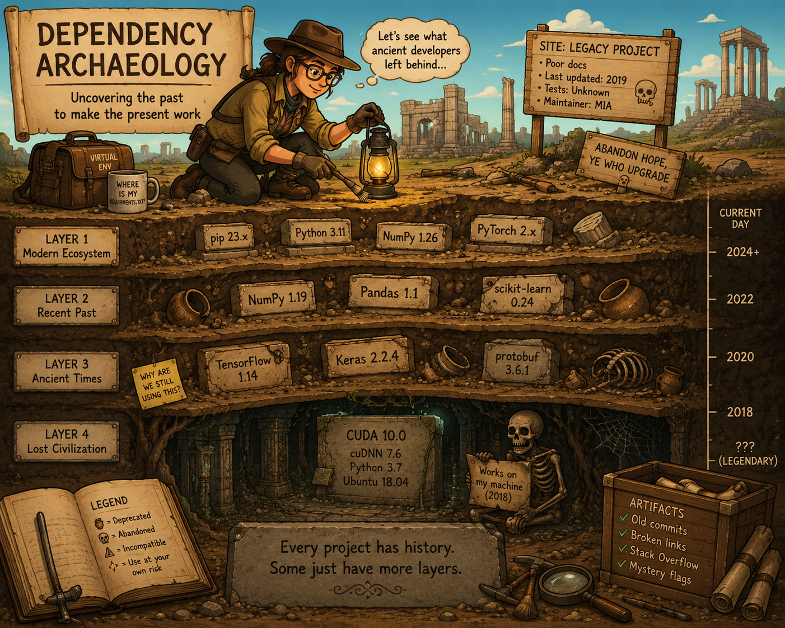

# Skills

My personal skills gallery. Primarily used with Codex. Should also work with other agents.

## Install

To install skills on Codex:

```
$skill-installer PRO-2684/skills slug1 slug2
```

## List

| Name | Slug | Desc | Pic? |
| - | - | - | - |
| [Cyber Mysophobia](./skills/cyber-mysophobia) | `cyber-mysophobia` | Prefer idiomatic and modern approaches, disregarding compatibility |  |
| [Dependency Archaeology](./skills/dependency-archaeology) | `dependency-archaeology` | Resolve dependency conflicts and make project environments reproducible |  |

